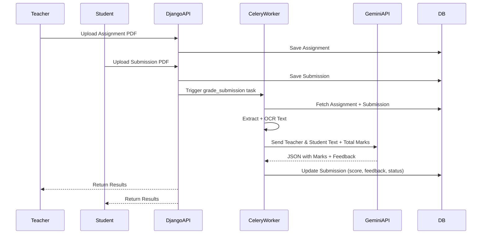

```mermaid
sequenceDiagram
    participant Teacher
    participant Student
    participant DjangoAPI
    participant CeleryWorker
    participant GeminiAPI
    participant DB

    Teacher->>DjangoAPI: Upload Assignment PDF
    DjangoAPI->>DB: Save Assignment
    Student->>DjangoAPI: Upload Submission PDF
    DjangoAPI->>DB: Save Submission
    DjangoAPI->>CeleryWorker: Trigger grade_submission task

    CeleryWorker->>DB: Fetch Assignment + Submission
    CeleryWorker->>CeleryWorker: Extract + OCR Text
    CeleryWorker->>GeminiAPI: Send Teacher & Student Text + Total Marks
    GeminiAPI-->>CeleryWorker: JSON with Marks + Feedback
    CeleryWorker->>DB: Update Submission (score, feedback, status)
    DjangoAPI-->>Teacher: Return Results
    DjangoAPI-->>Student: Return Results
```