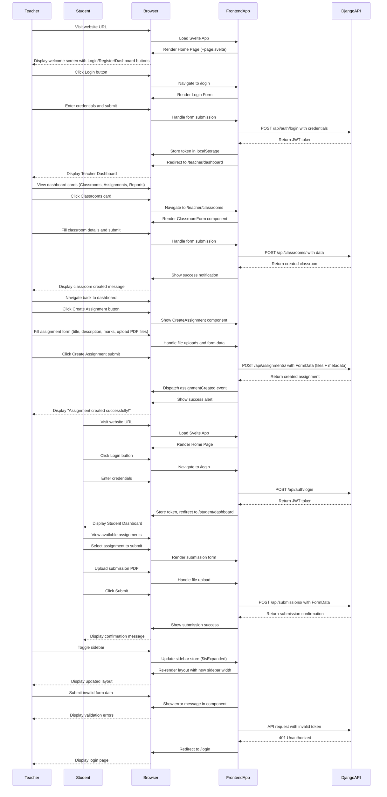

```mermaid
sequenceDiagram
    participant Teacher
    participant Student
    participant Browser
    participant FrontendApp
    participant DjangoAPI

    %% Home Page Access
    Teacher->>Browser: Visit website URL
    Browser->>FrontendApp: Load Svelte App
    FrontendApp->>Browser: Render Home Page (+page.svelte)
    Browser-->>Teacher: Display welcome screen with Login/Register/Dashboard buttons

    %% Authentication Flow
    Teacher->>Browser: Click Login button
    Browser->>FrontendApp: Navigate to /login
    FrontendApp->>Browser: Render Login Form
    Teacher->>Browser: Enter credentials and submit
    Browser->>FrontendApp: Handle form submission
    FrontendApp->>DjangoAPI: POST /api/auth/login with credentials
    DjangoAPI-->>FrontendApp: Return JWT token
    FrontendApp->>Browser: Store token in localStorage
    FrontendApp->>Browser: Redirect to /teacher/dashboard
    Browser-->>Teacher: Display Teacher Dashboard

    %% Teacher Dashboard Navigation
    Teacher->>Browser: View dashboard cards (Classrooms, Assignments, Reports)
    Teacher->>Browser: Click Classrooms card
    Browser->>FrontendApp: Navigate to /teacher/classrooms
    FrontendApp->>Browser: Render ClassroomForm component
    Teacher->>Browser: Fill classroom details and submit
    Browser->>FrontendApp: Handle form submission
    FrontendApp->>DjangoAPI: POST /api/classrooms/ with data
    DjangoAPI-->>FrontendApp: Return created classroom
    FrontendApp->>Browser: Show success notification
    Browser-->>Teacher: Display classroom created message

    %% Assignment Creation Flow
    Teacher->>Browser: Navigate back to dashboard
    Teacher->>Browser: Click Create Assignment button
    Browser->>FrontendApp: Show CreateAssignment component
    Teacher->>Browser: Fill assignment form (title, description, marks, upload PDF files)
    Browser->>FrontendApp: Handle file uploads and form data
    Teacher->>Browser: Click Create Assignment submit
    FrontendApp->>DjangoAPI: POST /api/assignments/ with FormData (files + metadata)
    DjangoAPI-->>FrontendApp: Return created assignment
    FrontendApp->>Browser: Dispatch assignmentCreated event
    FrontendApp->>Browser: Show success alert
    Browser-->>Teacher: Display "Assignment created successfully!"

    %% Student Flow
    Student->>Browser: Visit website URL
    Browser->>FrontendApp: Load Svelte App
    FrontendApp->>Browser: Render Home Page
    Student->>Browser: Click Login button
    Browser->>FrontendApp: Navigate to /login
    Student->>Browser: Enter credentials
    FrontendApp->>DjangoAPI: POST /api/auth/login
    DjangoAPI-->>FrontendApp: Return JWT token
    FrontendApp->>Browser: Store token, redirect to /student/dashboard
    Browser-->>Student: Display Student Dashboard

    %% Student Assignment Submission
    Student->>Browser: View available assignments
    Student->>Browser: Select assignment to submit
    Browser->>FrontendApp: Render submission form
    Student->>Browser: Upload submission PDF
    Browser->>FrontendApp: Handle file upload
    Student->>Browser: Click Submit
    FrontendApp->>DjangoAPI: POST /api/submissions/ with FormData
    DjangoAPI-->>FrontendApp: Return submission confirmation
    FrontendApp->>Browser: Show submission success
    Browser-->>Student: Display confirmation message

    %% Navigation and State Management
    Teacher->>Browser: Toggle sidebar
    Browser->>FrontendApp: Update sidebar store ($isExpanded)
    FrontendApp->>Browser: Re-render layout with new sidebar width
    Browser-->>Teacher: Display updated layout

    %% Error Handling
    Teacher->>Browser: Submit invalid form data
    FrontendApp->>Browser: Show error message in component
    Browser-->>Teacher: Display validation errors

    %% API Error Responses
    FrontendApp->>DjangoAPI: API request with invalid token
    DjangoAPI-->>FrontendApp: 401 Unauthorized
    FrontendApp->>Browser: Redirect to /login
    Browser-->>Teacher: Display login page
```